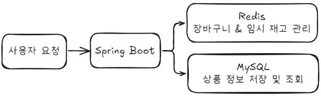

# 쇼핑몰 재고 관리 시스템
## 프로젝트 개요
이 프로젝트는 Spring Boot와 Redis를 활용한 쇼핑몰 재고 관리 시스템으로, 장바구니, 상품, 주문(결제기능 없이)과 관련된 기능을 포함합니다. 개인 학습용 프로젝트로, **동시성 제어 및 성능 최적화**를 중점적으로 다루며, 이를 통해 효율적인 재고 관리 방안을 학습합니다.

---

## 주요 기능
1. 장바구니 기능 (Redis 기반 캐싱)
   - 유저별 장바구니 데이터를 Redis에 저장
   - `cart:{userId}` 형태로 저장되면, **30분 TTL** 설정
   - 상품 추가/제거 시 임시 재고와 장바구니의 TTL이 갱신되도록 구현
2. 임시 재고 관리
   - 장바구니에 상품 추가 시, 임시 재고(remaining_stock:{productId})를 별도로 관리
   - 상품별 임시 재고는 **2시간 TTL** 설정
   - 장바구니 갱신에 의한 TTL 갱신은 30분 이하로 내려갔을 시에만 TTL이 갱신되도록 로직 작성
3. 동시성 문제 해결
   - Redis 기반 분산 락을 활용하여 동시에 여러 사용자가 같은 상품을 장바구니에 담을 때 발생할 수 있는 Race Condition 방지 로직
   - 테스트 코드를 작성하여 다양한 시나리오에서 동시성 문제를 검증
4. 

---

## 아키텍처 개요

- Spring Boot: API 서버
- Redis: 장바구니 및 임시 재고 관리
- MySQL: 상품 및 주문 정보 저장

---

## 트러블 슈팅 및 기술적 의사결정

---

## 프로젝트 구조

